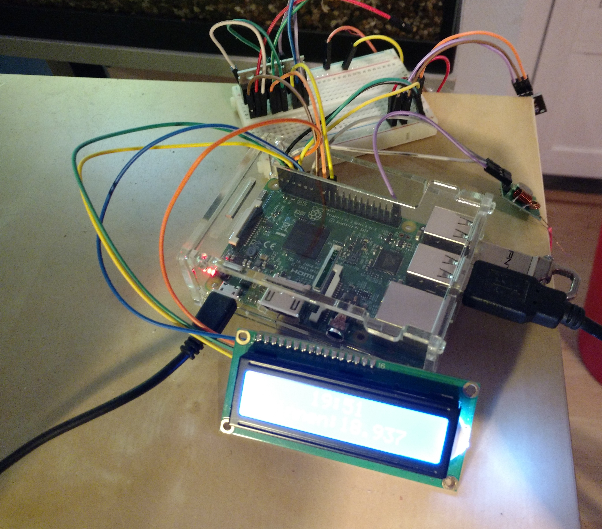
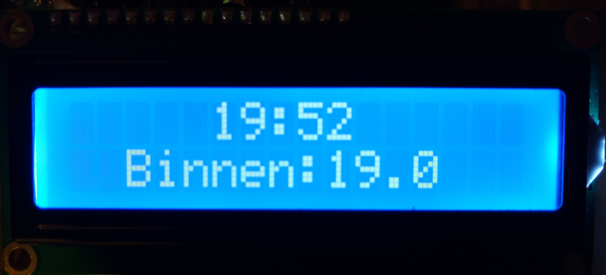
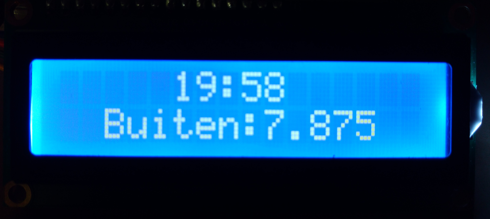

# survur
### Android
https://github.com/koenkoe/Home
  

- https://koenhabets.nl/graph/ (grafiek)
- https://koenhabets.nl/api/info

## Functies
- Lichten bedienen met android telefoon
- Binnen en buiten temperatuur met grafiek
- Beweginssensor op zonne-energie om lichten aan te laten gaan
- Automatisch alarm op basis van scholica agenda en lichten aan als alarm afgaat
- Lcd scherm met tijd, binnen en buiten temperatuur
- Wake on lan

Beweginssensor op zonnepanelen (esp8266)

